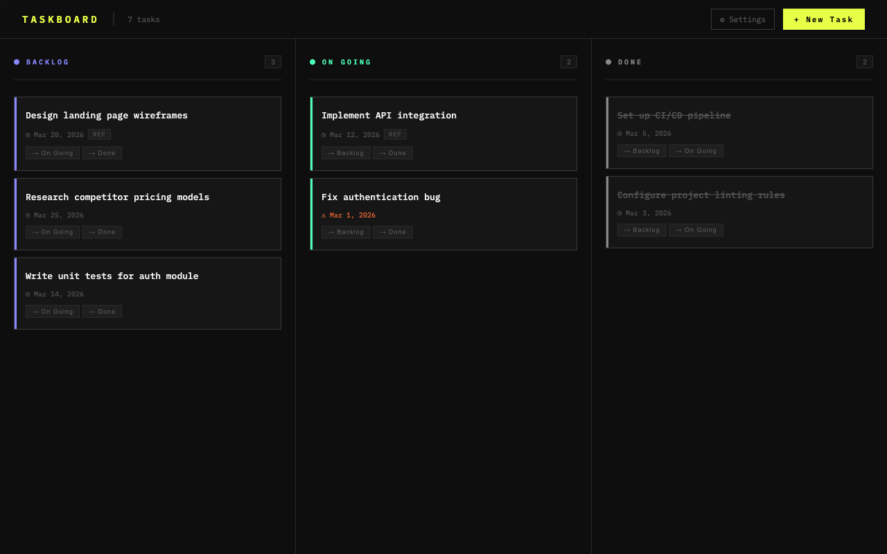
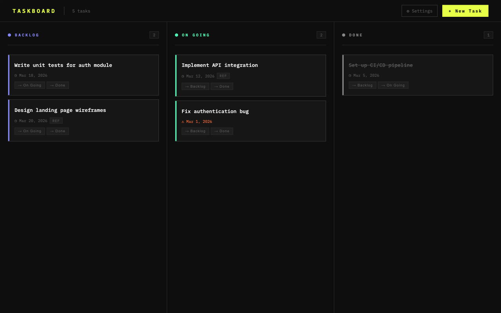
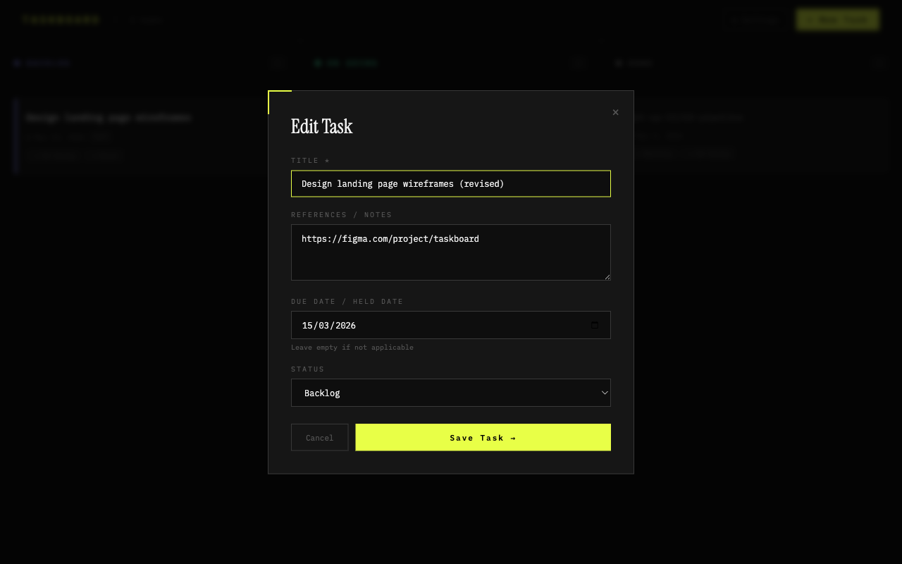
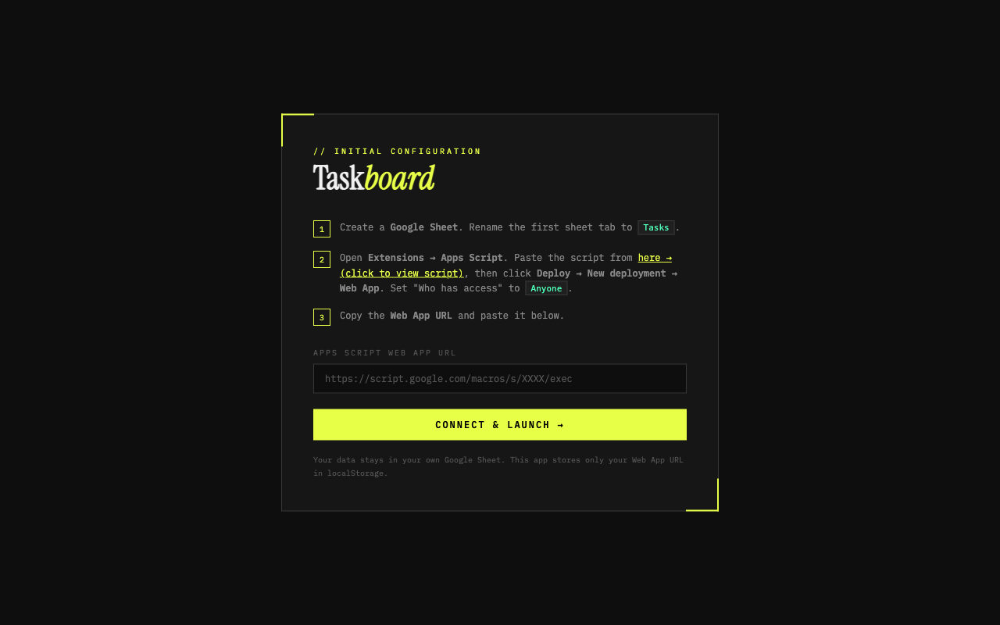
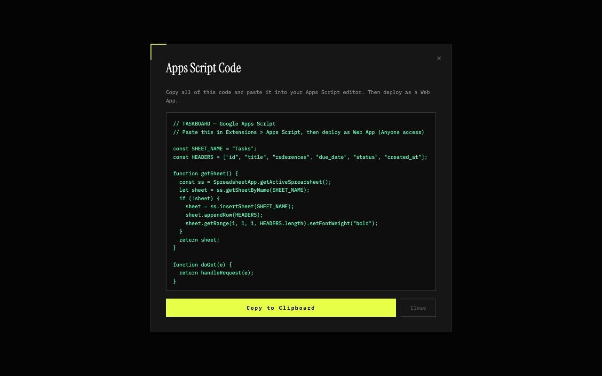

[](LICENSE)

# Taskboard

A minimal Kanban task board powered by Google Sheets — no backend needed.

**[Live Demo](https://lugassawan.github.io/taskboard/)**



## Features

### Kanban Board

Organize tasks across three columns — **Backlog**, **On Going**, and **Done**. Move tasks between columns with a single click.



### Create & Edit Tasks

Add tasks with a title, references/notes, due date, and status. Edit any task inline.

| New Task | Edit Task |
|----------|-----------|
|  |  |

### Due Date Tracking

Overdue tasks are highlighted in orange with a warning icon. Upcoming dates display normally.

### Setup Wizard

A guided 3-step setup connects the app to your own Google Sheet. The built-in Apps Script code is available with one click.

| Setup Screen | Apps Script Code |
|--------------|------------------|
|  |  |

### Other Highlights

- **Google Sheets backend** — your own spreadsheet is the database, no server required
- **Dark theme** — grid-pattern background, designed for long sessions
- **Responsive** — works on desktop and mobile
- **Privacy-first** — no analytics, no tracking; data stays in your Google Sheet
- **Zero dependencies** — pure vanilla JavaScript

## Getting Started

1. Create a **Google Sheet** and rename the first sheet tab to `Tasks`.
2. Open **Extensions > Apps Script**, paste the script shown in the app's setup screen, then **Deploy > New deployment > Web App** with access set to **Anyone**.
3. Copy the **Web App URL**, open the app, and paste it in the setup screen.

That's it — your tasks will sync with the spreadsheet.

## Tech Stack

| Layer | Technology |
|-------|------------|
| Frontend | Vanilla JavaScript, HTML, CSS |
| Typography | IBM Plex Mono, Instrument Serif (Google Fonts) |
| Data | Google Sheets + Apps Script |
| Hosting | GitHub Pages |

## Project Structure

```
taskboard/
├── index.html      # HTML shell with SEO meta tags
├── style.css       # All styles (dark theme, responsive)
├── app.js          # Application logic (CRUD, rendering, API)
├── assets/         # Screenshots for README
├── robots.txt      # Crawler directives
├── sitemap.xml     # Sitemap for search engines
├── LICENSE          # MIT License
└── .gitignore
```

## License

[MIT](LICENSE)
